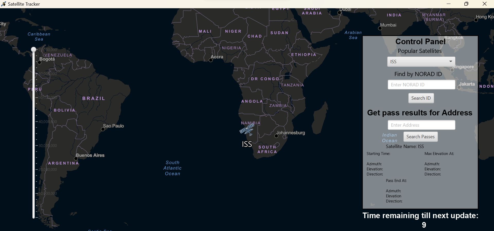

# SatTrack


Satellite Tracker is an open-source Java program that leverages the ArcGIS API and N2YO API to provide real-time tracking of satellites. This tool allows users to visualize the current locations of satellites, providing valuable information for tracking and monitoring purposes.


## Table of Contents

- [Introduction](https://github.com/snowclipsed/SatTrack?tab=readme-ov-file#introduction)
- [Getting Started](https://github.com/snowclipsed/SatTrack?tab=readme-ov-file#getting-started)
  - [Requirements](https://github.com/snowclipsed/SatTrack?tab=readme-ov-file#requirements)
  - [Installation and Setup](https://github.com/snowclipsed/SatTrack?tab=readme-ov-file#requirements)
  - [Deployment](https://github.com/snowclipsed/SatTrack?tab=readme-ov-file#deployment)
- [Configuration](https://github.com/snowclipsed/SatTrack?tab=readme-ov-file#configuration)
- [License](https://github.com/snowclipsed/SatTrack?tab=readme-ov-file#license)
- [Acknowledgment](https://github.com/snowclipsed/SatTrack?tab=readme-ov-file#acknowledgments)
- [Support](https://github.com/snowclipsed/SatTrack?tab=readme-ov-file#support)


## Introduction

### Features

- Real-time satellite tracking using ArcGIS and N2YO APIs.
- Interactive and user-friendly graphical interface.
- Displays detailed information about each tracked satellite, including name, NORAD ID, altitude, azimuth, and elevation.
- Customizable settings for filtering and displaying specific satellites.

## Getting Started

### Requirements

Before running the Satellite Tracker, ensure that you have the following prerequisites installed:

- Java Development Kit (JDK) 8 to 20
- ArcGIS API key (sign up [here](https://developers.arcgis.com/documentation/mapping-apis-and-services/get-started/))
- N2YO API key (obtainable [here](https://www.n2yo.com/api/))
- IntelliJ IDEA (recommended for instructions ahead)


### Installation

1. Clone the repository to your local machine:

   ```bash
   git clone https://github.com/snowclipsed/SatTrack
   ```

2. Navigate to the project directory:

   ```bash
   cd SatTrack
   ```

3. Open the directory as an IntelliJ IDEA Project (or go to IntelliJ Idea, click on `Open...` and open the project).

4. In IntelliJ IDEA, open the `src/main/java/com.example/app/Constants.java` file and provide your ArcGIS and N2YO API keys:

```properties
public static String ARCAPI = "your-arcgis-api-key";
public static String N2YOAPI = "your-n2yo-api-key";
```

5. To build the project using Gradle:
   1. Open the  `build.gradle` file and run it.
   2. Open the Gradle sidebar (if you do not have the sidebar, go to View > Tool Windows > Gradle).
   3. On the sidebar, go to Tasks and double click on the copyNatives function to run it. This will install some ArcGIS .jar files.

### Deployment

To deploy the project, run `src/main/java/com.example/app/App.java`. 

This will open the application window. **Make sure to fullscreen the application window once so graphic elements snap to the right place.**

In case you get an error regarding Gradle's install path, go to Settings > Build, Execution, Deployment > Build Tools > Gradle and put in the correct installation path.


## Configuration

You can customize the Satellite Tracker by modifying variables in the `src/main/java/com.example/app/App.java` file. Adjust parameters such as update frequency and default map zoom level according to your preferences.

```properties
# Application Configuration
private Integer frequency = 1000; # Update interval in milliseconds
private Double scale = 70000000.0;  # Default map zoom level
private Integer satID = 25544; # Default NORAD ID
```


## License

This project is licensed under the MIT License - see the [LICENSE](LICENSE) file for details.


## Acknowledgments

- Thanks to [ArcGIS](https://developers.arcgis.com/) for providing the powerful mapping capabilities.
- Thanks to [N2YO](https://www.n2yo.com/) for the comprehensive satellite tracking API.
- Thanks to Professor Brianna Dym for her constant support throughout this semester.
- Thanks to Dipti Kulkarni for educating me about ArcGIS API.
- Thanks to Rashaad M. Mirza for testing my program.


## Support

For any questions or issues, please [open an issue](https://github.com/your-username/satellite-tracker/issues) or contact me at bishnoi.h@northeastern.edu.

---

